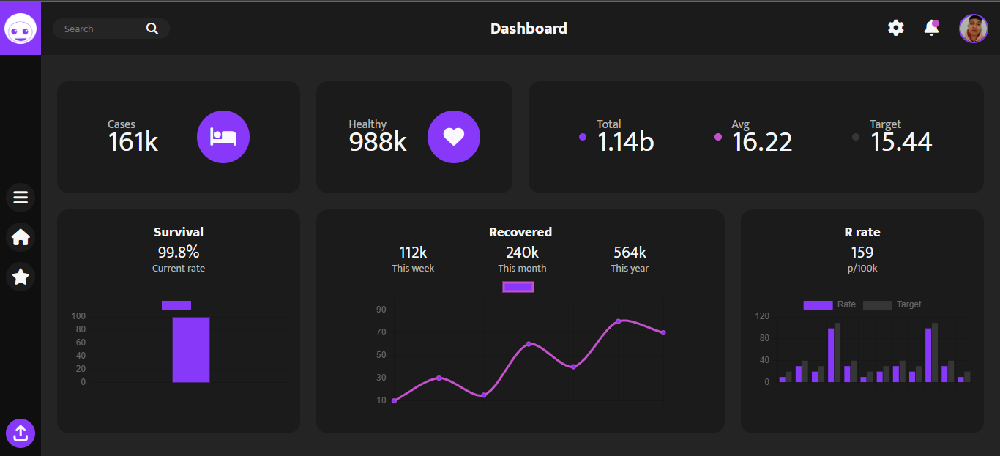
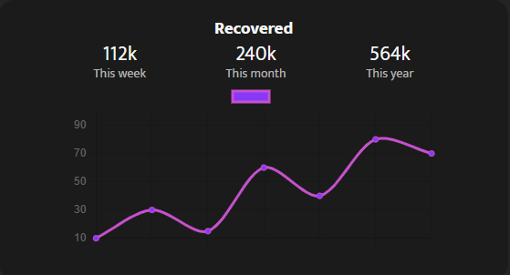
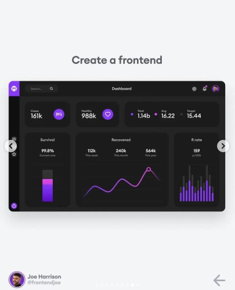

# **Dark Dashboard**



[Ver despliegue](https://flakobb.github.io/dark-dashboard/)

Es una pagina web estatica y responsive con la que he practicado mis habilidades de HTML, CSS (SASS), y JS.

La pagina muestra un portal de informacion dividido en segmentos que usando Grid para establecer la posicion de cada uno.

```CSS
.main-content {
    display: grid;
    place-content: center;
    grid-template-columns: repeat(4, 1fr);
    grid-template-rows: 30% auto;
}
```

Tambien se usa la libreria de JavaScript, ChartJS para la visualizacion de algunos graficos.

```JavaScript
const dataRecovered = {
    labels: ['', '', '', '', '', '', ''],
    datasets: [
        {
            label: '',
            data: [10, 30, 15, 60, 40, 80, 70, 99],
            backgroundColor: '#8738F9',
            borderColor: '#C651CD',
            tension: .3
        }
    ]
}

const configRecovered = {
    type: 'line',
    data: dataRecovered
}

const lineCanvas = document.getElementById('recovered-chart')

const lineChart = new Chart(lineCanvas, configRecovered)
```




---

## **Idea original**

